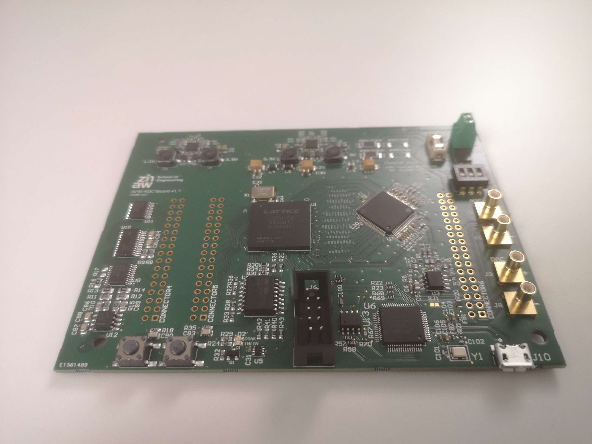
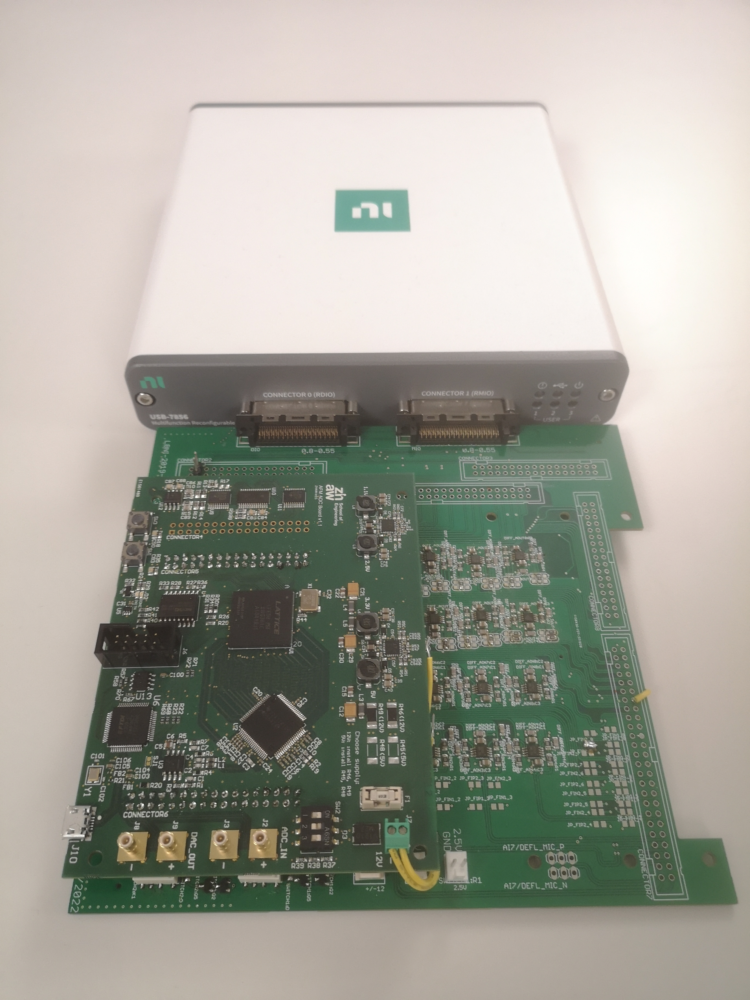

# ADC_for_Scanning_Probe_Microscopy_OMAHA
Hardware design of an analog to digital converter used in the scanning probe microscopy (SPM) developed within the scope of the OMAHA project

## Overview

The group High Performance Multimedia from the Institute of Embedded Systems associated with ZHAW School of Engineering has developed in cooperation with the Laboratory for Bio- and Nano- Instrumentation (LBNI) at EPFL a new and open source Analog Digital Converter (ADC). This was developed as a part of the Open Measurement Hardware for Scanning Probe Microscopy (OMAHA). The newly developed ADC enables faster conversion time and bandwith. This upgrade allow labor experiments at higher speed and accuracy. Furthermore, no expensive lab equipment is needed.

> Other projects from our group can be found in our [Blog](https://blog.zhaw.ch/high-performance/).

## Setup

The ADC is inteded to be used with the [Scanning Probe Microscopy (SPM) controller](https://www.epfl.ch/labs/lbni/spm-controller-software/) developed at EPFL. The following image shows the setup with the FPGA adapter board and the NI-USB-7856 FPGA that is used in the SPM controller.

## Bringup

For the bringup, the ADC has to be programmed to work as inteded. A quick and easy manual for this process can be found in the [wiki page](https://github.com/InES-HPMM/ADC_for_Scanning_Probe_Microscopy_OMAHA/wiki) of this repository.
